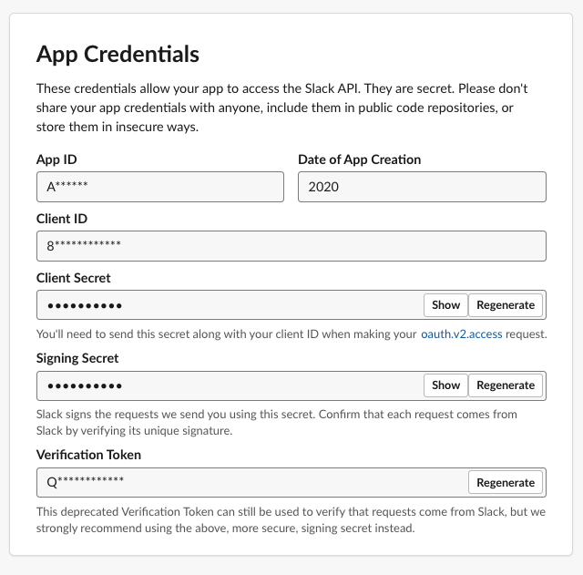
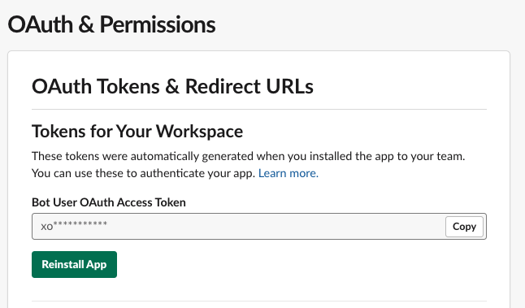

# Reminder Plus

Reminder Plus is a simple self-hosted alternative to [Slack](http://slack.com)'s [reminders](https://slack.com/intl/en-tr/help/articles/208423427-Set-a-reminder) with customizable snooze times.

Table of contents
=================

  * [Installation](#installation)
    * [PHP](#php)
    * [Database](#database)
    * [Creating a Slack App](#creating-a-slack-app)
    * [Config](#config)
    * [Cron](#cron)
  * [Usage](#usage)
    * [Adding a new reminder](#adding-a-new-reminder)   
    * [Date formats](#date-formats)

## Installation

### PHP

* Place the `.php` files to a public directory.

### Database

* Create a MySQL database using [ddl.sql](ddl.sql) file:

```
mysql -u yourusername -p yourpassword < ddl.sql
```

### Creating a Slack App

1. Click `Create New App` at https://api.slack.com/apps.


---

2. Write down the `App ID` and the `Verification Token` from `Basic Information` tab's `App Credentials` section.



---

3. In `Interactive Components` tab, enter your URL with the path of `req.php` for the `Request URL` in `Interactivity` section.


---

4. In `OAuth & Permissions` tab, navigate to `Scopes` section. Add `chat:write` and `im:history` as OAuth Scopes.


---

5. Click `Install App to Workspace` button in the top of the same tab. And `Allow` the app.


---

6. Go back to `OAuth & Permissions` tab and write down the `Bot User OAuth Access Token`.



---

7. Enable `Always Show My Bot as Online` option from `App Home` tab.


---

8. Go to `Event Subscriptions` tab and enable `Enable Events` radio button. Enter the same `req.php` full path to the `Request URL`.


---

9. In `Subscribe to bot events` section add `message.im` as the Bot User Event.


### Config

* Edit [constants.php](constants.php) file to set the values that you got while creating the Slack app:

```
define('AUTH_TOKEN', '<Bot User OAuth Access Token> from step 6');
define('APP_ID', '<App ID> from step 2');
define('VERIF_TOKEN', '<Verification Token> from step 2');
```

### Cron

* Create a cron job to run [cron.php](cron.php) every minute:

```
* * * * * php /var/www/reminder-plus/cron.php > /dev/null
```


## Usage

After adding the bot to your workspace you can type `help` to find out the available commands.

### Adding a new reminder

Add your reminder with the following syntax:

`"[reminder content]" [date format]`, e.g. `"My first reminder" dec 19 17:15`


### Date formats

* `dec 19` - _reminder at default hour_
* `dec 19 12:15` - _reminder at specified hour_
* `dec 19 21` - _reminder at the top of the specified hour (21:00)_
* `16:30` - _reminder at the specified hour for today_
* `16` - _reminder at the top of the specified hour for today_
* `tomorrow` or `tm` - _reminder at default hour for tomorrow_
* `tomorrow 14` or `tm 14` - _reminder at the top of the specified hour for tomorrow (14:00)_
* `tomorrow 14:15` or `tm 14:15` - _reminder at the specified hour for tomorrow_
* `mon` to `sun` - _reminder at the default hour in the next occurrence of the specified day_
* `mon 14` - _reminder at the top of the specified hour in the next occurrence of the specified day (14:00)_
* `mon 14:15` - _reminder at the specified hour in the next occurrence of the specified day_
* `in 3h` or `in 30m` or `in 1h 30m` - _relative times to now_

### Listing reminders

* `list` or `l` - list incomplete reminders
* `list all` or `la` - list all reminders 

### Preferences

* `pref hour [time]` - set yout default hour. e.g. `pref hour 09:30`
This value will be used when you enter a date without a specified hour.

* `pref snooze [time]` - set your snooze times. e.g. `pref snooze in 1h, 14:30, 17:30, tomorrow`
This values will be used as preset values in snooze menu.
